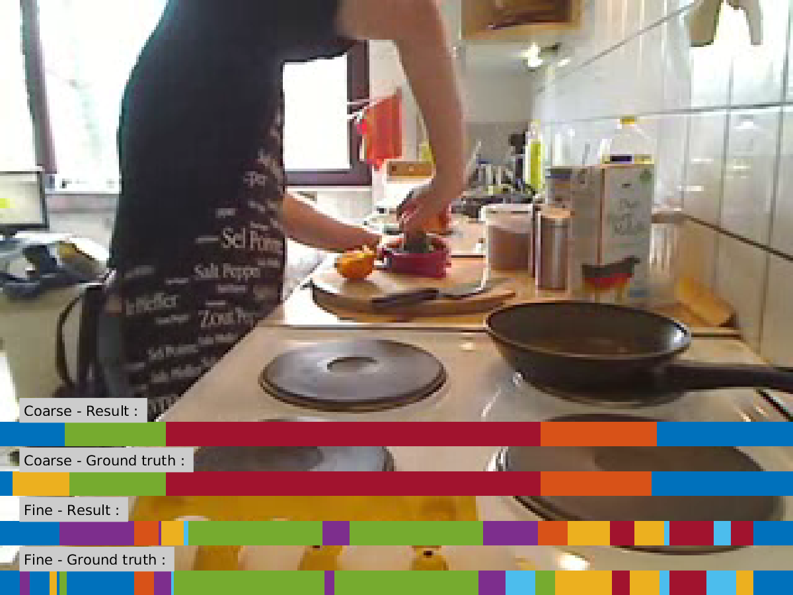
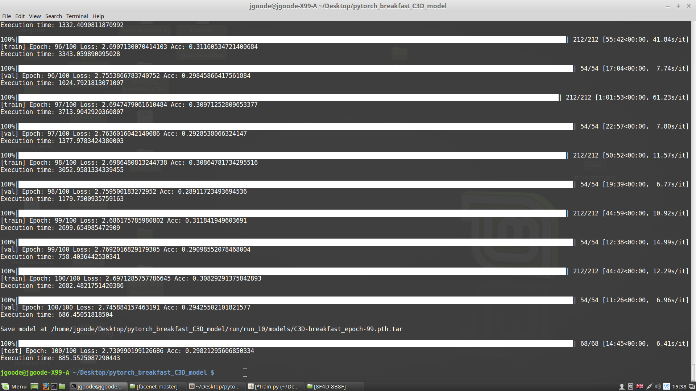
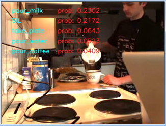

# Pytorch video human action recognition 

<table style="border:0px">
   <tr>
       <td></td>
       <td></td>
       <td></td>
   </tr>
</table>

## Introduction
This repo contains several models for video human action recognition,
including C3D implemented using PyTorch (0.4.0).
Currently, we train the model on the Breakfast Action Dataset


## Installation
The code was tested pip and Python 3.5.

1. Clone the repo:
    ```Shell
    git clone https://github.com/cantonioupao/pytorch-human_action_recognition_breakfast_dataset-C3D_model_implementation.git
    cd pytorch-human_action_recognition_breakfast_dataset-C3D_model_implementation
    ```

2. Install dependencies:

    For PyTorch dependency, see [pytorch.org](https://pytorch.org/) for more details.

    For custom dependencies:
    ```Shell
    conda install opencv
    pip install tqdm scikit-learn tensorboardX
    ```

3. Download pretrained model from [BaiduYun](https://pan.baidu.com/s/1saNqGBkzZHwZpG-A5RDLVw) or 
[GoogleDrive](https://drive.google.com/file/d/19NWziHWh1LgCcHU34geoKwYezAogv9fX/view?usp=sharing).
   Currently only support pretrained model for C3D.

3. Configure your dataset and pretrained model path in
[mypath.py](https://github.com/cantonioupao/pytorch-human_action_recognition_breakfast_dataset-C3D_model_implementation/blob/master/mypath.py).

4. You can choose different models and datasets in
[train.py](https://github.com/cantonioupao/pytorch-human_action_recognition_breakfast_dataset-C3D_model_implementation/master/train.py).

    To train the model, please do:
    ```Shell
    python train.py
    ```

## Datasets:

I used the Breakfast Action Dataset and downloaded from Serre Lab http://serre-lab.clps.brown.edu/resource/breakfast-actions-dataset/

Dataset directory tree for the:

- **Downloaded Breakfast Action Dataset**

  ```
  Breakfast
  ├── PO3
  │   ├── webcam
  │   │   ├── cereals.avi
  │   │   ├── cereals.txt
  │   │   └── ...
  │   └── ...
  ├── PO4
  │   ├── stereo
  │   │   ├── coffee.avi
  │   │   ├── coffee.txt
  │   │   └── ...
  │   └── ...
  └── PO5
  │   ├── cam1
  │   │   ├── pancake.avi
  │   │   ├── pancake.txt
  │   │   └── ...
  │   └── ...
  ``` 
After pre-processing, the output dir's structure is as follows:
- **Breakfast Action Dataset output directory "break"**
  ```
  break
  ├── stir_milk
  │   ├── PO3_webcam_milk_123_450
  │   │   ├── 00001.jpg
  │   │   └── ...
  │   └── ...
  ├── stir_coffee
  │   ├── PO4_stereo_coffee_223_320
  │   │   ├── 00001.jpg
  │   │   └── ...
  │   └── ...
  └── fryegg
  │   ├── PO5_cam1_pancake_1_230
  │   │   ├── 00001.jpg
  │   │   └── ...
  │   └── ...
  ```


## Experiments
These models were trained in machine with NVIDIA TITAN X 12gb GPU. Note that I splited
train/val/test data for each dataset using sklearn. If you want to train models using
official train/val/test data, you can look in [dataset.py](https://github.com/https://github.com/pytorch-human_action_recognition_breakfast_dataset-C3D_model_implementation.git/blob/master/dataloaders/dataset.py), and modify it to your needs.

Currently, I only train C3D model in the Breakfast Action Dataset. The train/val/test
accuracy and loss curves for each experiment are shown below:

- **Breakfast Action Dataset**
After succesfully preprocessing and dividing the Breakfast Action Dataset, the output dataset directory size is 50GB. The new output directory holds all the action videos (converted to frames) and is classified based on the 48 actions and not the 10 activities. After running the "train.py" and seeting the hyperparameters of the framework( e.g batch_size , # of epochs, clip_length). The CMD training and tensorboard results are demonstrated below. 


<p align="center"></p>
<p align="center"></p>

The overall accuracy for training the framework on the first set of hyperparameters is 30.26%.The actual accuracy of the framework can be tested by selecting any video from the Breakfast Action Dataset randomly and running it though the "inference.py". The results for a random video of the dataset, with the 5 hihgest probability actions are demonstrated below:

<p align="center"></p>
